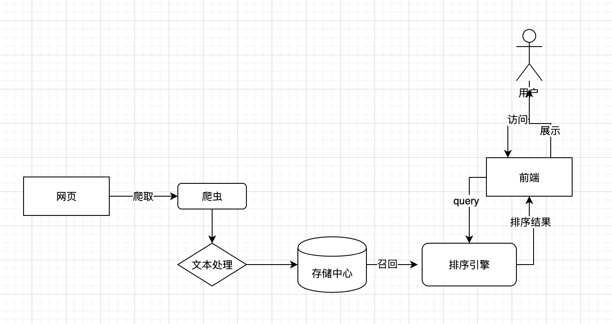
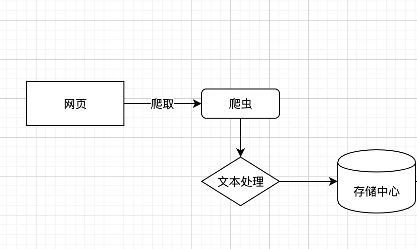
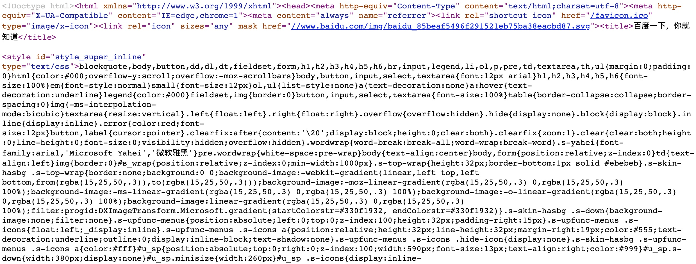
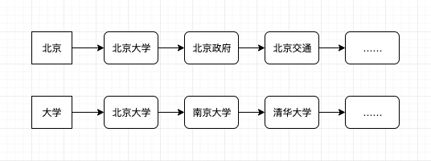
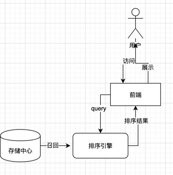

谈及机器学习，大家想必会有许多联想，比如最近火热的人工智能，再比如战胜李世石的AlphaGo，甚至还会有人联想起骇客帝国或者是机械公敌等经典机器人电影。

但实际上目前机器学习虽然应用广泛，但是在各大互联网公司当中，最主要的应用场景变化并不大。基本上还是延续从前的三板斧——搜索、推荐、广告。今天，我们就来聊聊其中的大头——搜索。搜索算法在互联网公司最大的用户就是搭建搜索引擎，而搜索引擎几乎是各大互联网公司的标配，无论是电商、社区还是社交软件，都离不开搜索引擎的身影。BAT三家当中的百度，当年正是凭借的高质量的中文搜索引擎，才一跃成为中国最大的互联网公司之一。

虽然搜索引擎非常重要，也和我们的生活息息相关，但是即使是互联网从业者，了解它的原理结构的也很少。在了解具体的搜索算法之前，不妨让我们先来熟悉一下搜索引擎的架构。看看GitHub当中那些单枪匹马实现搜索引擎的大牛们， 究竟做了一件怎样的事情。

这是一个简易版的搜索引擎架构，原谅我的灵魂画风。

搜索引擎的功能主要分为两个部分，第一个部分是爬虫相关，第二个部分是搜索和排序。我们将这两个部分分开，分别介绍。

首先是爬虫部分，即上图当中左边的部分。

爬虫也有些地方称为蜘蛛，本质上是一个自动访问互联网的程序。我们都知道互联网当中的网页千千万万，想要靠人工去一个一个搜集是不现实的。所以爬虫就是代替人工去浏览互联网的程序，每当发现一个新的网站，就会把网站的内容抓取下来，存储起来。

这里有一个问题，爬虫怎么知道互联网当中网站的地址呢？

主要靠的是网站之间的联系，比如A网站当中的内容有指向B网站的链接，那么在爬取完A网站之后，爬虫会顺着当中的内容，去爬取B网站。如果B网站又有指向很多其他网站，那么爬虫会顺着依次访问。存储在内容当中的链接就像是蛛丝一样，将各个网页链接起来，爬虫就像是蜘蛛，在里面移动。

我们日常看到的网站内容非常丰富，既有文本，也有图片还有视频等多媒体。但是我们都知道，当今的网站的基础是HTML，即超文本标记语言，比如我打开百度，显示网页源代码的话会显示以下内容：

也就是说在爬虫程序的眼里，所有的网页都只是文本，连图片或者是视频在HTML里也只是以标签或者是链接的形式存在。我们也都看得出来，这一段文本杂乱无章，人眼很难看得出来当中都有什么信息。这样的文本当然是不能直接使用的，还需要进行文本处理。

这里的处理主要包括两个步骤，第一个步骤是清洗HTML标签，只保留关键的文本信息。经过这一个步骤之后，文本的内容会大大压缩。比如百度的首页如果进行去标签处理，剩下的应该只有“百度一下，马上知道”以及搜索栏下方几篇文章的标题。

文本处理的第一个步骤比较简单，Python当中有非常成熟的HTML分析的工具，第二个步骤则要复杂得多。当我们拿到了网页的文本之后，我们下一步要做的是提取网页的关键词，并处理成索引进行存储。

说起来一句话就足够描述，但实际并不容易。对于中文而言，需要提取关键词，首先需要分词。比如“百度一下”，这四个字当中其实暗含了“百度”和”一下“两个词语。如果我们不进行分词，那么只有用户输入”百度一下“这四个字才能搜索到百度的网页，这显然是不合理的。但是中文和英文不同，词语和词语之间没有空格分开，所以需要用文本算法来进行分词。这个问题目前通过机器学习来实现，还没有完美的解法。

有了文本分词的结果之后，只会保留当中的一些关键词进行存储。存储的时候，除了会存储网页-关键词这个正向信息之外，其实还会存储关键词-网页的反向信息。在存储中心，网页是按照关键词聚集的。每个关键词会对应一个网站的列表，所有含有这个关键词的网站都会被存在这个列表当中。这样当用户搜索关键词的时候，就可以根据关键词直接找到对应的网站了。

如图，在搜索引擎当中，北京和大学是两个关键词，分别对应一系列包含这个关键词的网站。假设从前系统当中没有北京大学的官网，最近刚刚被爬虫抓到。由于北大的官网中有北京和大学两个关键词，所以在进行存储的时候，系统会将北京大学这个网址添加进北京和大学两个关键词对应的列表当中。这样，无论我们搜索北京还是大学，都可以召回北京大学这个网站。

当然无论我们搜索北京还是大学，召回的内容都非常多，并不一定能够返回北京大学。当我们搜索北京大学的时候，搜索引擎会同时召回北京和大学这两个关键词的网站，之后会做交集。选出既含有北京又含有大学的网站，进行返回，这样就一定可以返回北京大学的官网了。

除了爬虫之外，搜索引擎另一个重要的部分是用户端的服务，即是架构图中的右边部分。

在我们了解了存储中心的原理之后，整个流程其实已经很清楚了。简单来说只做了两件事情，一件是召回，另一件是排序。

召回顾名思义，就是通过用户输入的关键词去存储中心找出这些关键词对应搜索结果。再对这些结果做交集，找出匹配度最高的内容。

由于存储的数据量非常大，要处理的内容很多，并且对系统性能的要求很高（用户的耐心是有限的）。所以在召回阶段，不可能处理得非常细致，是在粗粒度上筛选出基本符合要求的内容。虽然每次我们百度的时候，它都会告诉我们搜索到了数以百万计甚至更多的结果，但是实际上真正通过粗排召回来的，可能只有一两千条。

既然有粗排，那么自然也有精排。其实也很好理解，经过了粗排，数据从数千万减少到了一两千。接下来要做的就是对这一两千条数据进行进一步排序。排序的主要依据往往不止一个，首要的当然是匹配度，如果返回的网站和用户的诉求不匹配，显然会损伤用户体验，甚至导致用户流失。所以无论什么搜索引擎，质量永远是第一位。之后的依据各个引擎均有所不同，有些网站可能更加看重收益，所以会把收钱多的网站摆在前面，有些网站则更看重权威，会把热度比较高的，或者是比较官方的网站置顶。经过一系列的调整和过滤之后，结果才会真正返回给用户。

到这里，整个搜索引擎的架构就介绍完了。就单从架构来看，这个系统并不算复杂。在电商网站当中，比这个复杂的系统比比皆是。但是由于搜索引擎是互联网的入口，承载的流量巨大，并且对于性能的要求极高，使得整个系统当中存在大量的优化，实际上的系统要复杂和困难得多。

我们抛开难度不谈，仔细分析这个架构，其实会发现一点有趣的地方。比如，我有时候在想，为什么中文的搜索引擎最早做得最好的是百度呢？

后来我了解到李彦宏最早是北大图书馆学出身，再一看这个搜索引擎的架构和索引的结构， 不就和图书管理一模一样吗？在搜索引擎出现之前，图书馆中的书籍也是根据类别、关键字以及作者进行归类存放的。这样在检索的时候，才可以快速地找到相应的书籍。这个思想计算机出现之前就已经非常成熟了，如果我们更换一下概念，把互联网当中的网页当做是书籍，把网页的title当做是书籍的标题，正文当中的关键字当做是书籍的关键字，那么搜索网页和搜索书籍的技术在思想上其实是相通的。那么当年图书馆学出身的李彦宏在学了计算机之后，想到在互联网世界当中应用图书检索的技术，也就水到渠成了。

看来一个人能有多大的成就，除了个人奋斗之外，果然也要看历史的进程。

