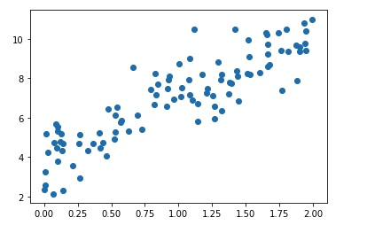
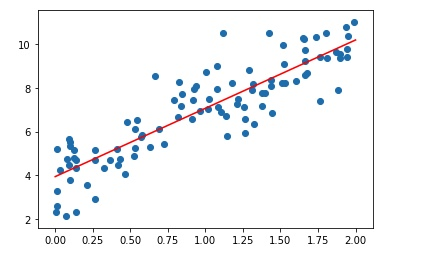

在之前的文章当中，我们介绍过了简单的朴素贝叶斯分类模型，介绍过最小二乘法，所以这期文章我们顺水推舟，来讲讲线性回归模型。

线性回归的本质其实是一种统计学当中的回归分析方法，考察的是自变量和因变量之间的线性关联。后来也许是建模的过程和模型训练的方式和机器学习的理念比较接近，所以近年来，这个模型被归入到了机器学习的领域当中。然而，不管它属于哪个领域，整个模型的思想并没有发生变化。我们只要有所了解即可。

### 模型概念

线性回归的定义非常简单，它最简单的形式其实就是一元一次方程组。比如，我们有如下式子：

$$y=wx+b$$

我们知道若干的x和y，要求w和b。解的方法很简单，我们通过消元法，就可以很容易求出来w和b。

我们针对以上的式子做两个变形，第一个变形是我们的自变量x不再是一个单值，而是一个m * n的矩阵。m表示样本数，n表示特征数，我们写成X。X矩阵的每一行是一个n维的行向量，它代表一个样本。它的系数W也不再是一个值，而是一个n * 1的列向量，它的每一维代表一个样本当中这一维的权重。我们把上面的公式写成矩阵相乘的形式：

$$Y=XW+b$$

式子里的Y、X和W分别是m * 1, m * n和n * 1的矩阵。

这里有两点要注意，第一点是这里的b我们可以当做是一个浮点数的参数，但是实际上它也是一个m * 1的矩阵（列向量）。但即使我们用的是浮点数也没关系，因为在我们实现模型的时候，numpy或者TensorFlow或者是其他的框架会自动地使用广播将它转化成向量来做加法。

第二点是这里的X写在了W的前面，这也是为了矩阵乘法计算方便。当然我们也可以将X和W都转置，写成WX，但这样得到的结果是一个1 * m的行向量，如果要和Y进行比较，那么还需要再进行一次转置。所以为了简便，我们对调了X和W的顺序。所以大家不要觉得疑惑，明明是WX+b怎么写出来就成了XW+b了。

我们把式子列出来之后，目标就很明确了，就是要通过计算求到一个W和b使得式子成立。但是在此之前，我们需要先明确一点：在实际的工程应用场景当中，是不可能找到W和b使得XW+b恰好和Y完全相等的。因为真实的场景当中数据都存在误差，所以精确的解是不存在的，我们只能退而求其次，追求尽可能精确的解。

### 最小二乘法与均方差

在之前的文章当中我们介绍过最小二乘法，遗忘的同学可以点击下方链接回顾一下。

### 之前的链接

在机器学习的过程当中，模型不是直接达到最佳的，而是通过一步一步的迭代，效果逐渐提高，最终收敛不再剧烈变化。我们明白了这个过程，就能理解，在学习的过程当中，我们需要一个量化的指标来衡量模型当前学习到的能力。就好像学生在上学的时候需要考试来测试学生的能力一样，我们也需要一个指标来测试模型的能力。

对于回归模型而言，预测的目标是一个具体的值。显然这个预测值和真实值越接近越好。我们假设预测值是$\hat{y}$，真实值是y，显然应该是$|y-\hat{y}|$越小越好。

但是绝对值的计算非常麻烦，也不方便求导，所以我们通常会将它平方，即：$(y-\hat{y})^2$最小。对于m个样本而言，我们希望它们的平方和尽量小：$\sum_{i=1}^m(y_i - \hat{y_i})^2$。

这个式子和我们之前介绍的方差非常相似，只不过在方差当中减的是期望值，而在这里我们减的是真实值。所以这个平方差也有一个类似的名称，叫做均方差。

方差反应的是变量在期望值附近的震荡程度，同样的，均方差反应的是模型预测值距离真实值的震荡程度。

寻找最佳的参数来使得均方差尽量小，就是最小二乘法。


### 推导过程

到这里，我们已经搞清楚了模型的公式，也写出了优化的目标，已经非常接近了，只剩下最后一步，就是优化这个目标的方法。

如果我们观察一下均方差，我们把它写全：$(Y-(XW+b))^2$，我们将W视作变量的话，这其实是一个广义的二次函数。二次函数怎么求最小值？当然是求导了。

在求导之前，我们先对均方差做一个简单的变形：我们想办法把b处理掉，让式子尽可能简洁。

首先，我们在X当中增加一列1，也就是将X变成m * (n+1)的矩阵，它的第一列是常数1，新的矩阵写成$X_{new}$

同样，我们在W中也增加一行，它的第一行写成b，我们将新的矩阵写成$\theta$，我们可以得到：

$$XW+b = X_{new}\theta=\left[
\begin{matrix}
1 & x_{11} & x_{12} & \cdots & x_{1n}\\
1 & x_{21} & x_{22} & \cdots & x_{2n}\\
\vdots & \vdots & \vdots & \vdots & \vdots\\
1 & x_{m1} & x_{m2} & \cdots & x_{mn}
\end{matrix}
\right] \cdot \left[
\begin{matrix}
b & w_1 & w_2 \cdots w_n
\end{matrix}
\right]$$

之后，我们对均方差进行变形：

$$J(\theta) = \frac{1}{2m}\sum_{i=1}^m(x_i\cdot \theta - y_i)^2$$

这里的m是样本的数量，是一个常数，我们对均方差乘上这个系数并不会影响$\theta$的取值。这个$J(\theta)$就是我们常说的模型的损失函数。

这里的损失其实是误差的意思，损失函数的值越小，说明模型的误差越小，和真实结果越接近。

我们计算$J(\theta)$对$\theta$的导数：

$$\frac{\partial J(\theta)}{\partial \theta}=\frac{1}{m}X^T(X\theta - Y)$$

我们令导数等于0，由于m是常数，可以消掉，得到：

$$
\begin{aligned}
X^T(X\theta - Y) &= 0 \\
X^TX\theta &= X^TY \\
\theta &= (X^T \cdot X)^{-1}X^TY
\end{aligned}
$$

上面的推导过程初看可能觉得复杂，但实际上并不困难。只是一个简单的求偏导的推导，我们就可以写出最优的$\theta$的取值。

从这个公式来看并不难计算，实际上是否真的是这么简单呢？我们试着用代码来实验一下。

### 代码实验

为了简单期间，我们针对最简单的场景：样本只有一个特征，我们首先先试着自己生产一批数据：

```python
import numpy as np
X = 2 * np.random.rand(100, 1)
y = 4 + 3 * X + np.random.randn(100, 1)

import matplotlib.pyplot as plt
plt.scatter(X, y)
```

我们先生成一百个0~2范围内的x，然后y= 3x + 4，为了模拟真实存在误差的场景，我们再对y加上一个0~1范围内的误差。

我们把上面的点通过plt画出来可以得到这样一张图：



接着，我们就可以通过上面的公式直接计算出$\theta$的取值了：

```python
def get_theta(x, y):
    m = len(y)
    # x中新增一列常数1
    x = np.c_[np.ones(m).T, x]
    # 通过公式计算theta
    theta = np.dot(np.dot(np.linalg.inv(np.dot(x.T, x)), x.T), y)
    return theta
```

我们传入x和y得到theta，打印出来看，会发现和我们设置的非常接近：


最后，我们把模型拟合的结果和真实样本的分布都画在一张图上：

```python
# 我们画出模型x在0到2区间内的值
X_new = np.array([[0],[2]])
# 新增一列常数1的结果
X_new_b = np.c_[np.ones((2, 1)), X_new]
# 预测的端点值
y_predict = X_new_b.dot(theta)

# 画出模型拟合的结果
plt.plot(X_new, y_predict,"r-")
# 画出原来的样本
plt.scatter(X,y)
plt.show()
```

得到的结果如下：



从结果上来看模型的效果非常棒，和我们的逾期非常吻合，并且实现的代码实在是太简单了，只有短短几行。

但实际上，有一点我必须要澄清，虽然上面的代码只有几行，非常方便，但是在实际使用线性回归的场景当中，我们并不会直接通过公式来计算$\theta$，而是会使用其他的方法迭代来优化。

那么，我们为什么不直接计算，而要绕一圈用其他方法呢？

原因也很简单，第一个原因是我们计算$\theta$的公式当中用到了逆矩阵的操作。在之前线性代数的文章当中我们曾经说过，只有满秩矩阵才有逆矩阵。如果$X^T \cdot X$是奇异矩阵，那么它是没有逆矩阵的，自然这个公式也用不了了。

当然这个问题并不是不能解决的，$X^T \cdot X$是奇异矩阵的条件是矩阵$X$当中存在一行或者一列全为0。我们通过特征预处理，是可以避免这样的事情发生的。所以样本无法计算逆矩阵只是原因之一，并不是最关键的问题。

最关键的问题是复杂度，虽然我们看起来上面核心的代码只有一行，但实际上由于我们用到了逆矩阵的计算，它背后的开销非常大。，$X^T \cdot X$的结果是一个n * n的矩阵，这里的n是特征的维度。这样一个矩阵计算逆矩阵的复杂度大概在$n^{2.4}$到$n^3$之间。随着我们使用特征的增加，整个过程的复杂度以指数级增长，并且很多时候我们的样本数量也非常大，我们计算矩阵乘法也会有很大的开销。

正是因为以上这些原因，所以通常我们并不会使用直接通过公式计算的方法来求模型的参数。

那么问题来了，如果我们不通过公式直接计算，还有其他方法求解吗？

欢迎期待我们机器学习专题的下篇文章。

今天的文章就到这里，如果觉得有所收获，请顺手点个在看或者转发吧，你们的支持是我最大的动力。

