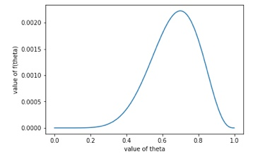

今天这篇文章和大家聊聊朴素贝叶斯模型，这是机器学习领域非常经典的模型之一，而且非常简单，适合初学者入门。

朴素贝叶斯模型，顾名思义和贝叶斯定理肯定高度相关。之前我们在三扇门游戏的文章当中介绍过贝叶斯定理，我们先来简单回顾一下贝叶斯公式：

$$P(A|B)=\frac{P(A)P(B|A)}{P(B)}$$

我们把$P(A)$和$P(B)$当做先验概率，那么贝叶斯公式就是通过先验和条件概率推算后验概率的公式。也就是寻果溯因，我们根据已经发生的事件去探究导致事件发生的原因。而朴素贝叶斯模型正是基于这个原理，它的原理非常朴素，朴素到一句话就可以概率：当一个样本有可能属于多个类别的时候，我们简单地选择其中概率最大的那个。

所以，既然是选择样本所属的类别，显然朴素贝叶斯模型是一个分类算法。

在我们具体介绍算法原理之前，我们先来熟悉几个概念。其中几个概念在我们之前的文章当中也介绍过，这里就当做复习。

### 先验概率

先验概率其实很好理解，我们先不管里面”先后“这两个字。说白了，其实先验概率就是我们可以事先通过做实验计算的概率。比如抛硬币正面朝上，比如在一个路口遇到红灯，再比如明天会下雨。

这些事情，有些是我们可以通过实验得到的，有些是可以根据之前的经验估计的。在我们问题当中，这些事件的概率是相对明确的。可以认为是我们在做模型探究之前就可以确定的概率，所以称为先验概率。


### 后验概率

后验概率从直观上来看与先验概率相反，是我们通过实验或者是之前的经验没有办法直接获取的。它更多的指的是某个事件由于某个原因或者是另一个事件导致的概率。

举个例子来说，一个学生参加考试，能够及格的概率是可以测量的。无论通过一个学生多次考试进行测试，还是批量学生进行统计，都是可行的。但假设学生在考试之前可以选择复习或者是打游戏，显然，复习会提升学生通过的概率，打游戏可能会降低也可能变化不大，我们不得而知。假设我们知道小明已经通过了考试，想要知道他在考试之前有没有复习，这就是一个后验概率。

从逻辑上来看，它和条件概率恰好相反。条件概率是事件A发生的前提下会发生事件B的概率，而后验概率是已经知道事件B发生了，求事件A发生的概率。


### 似然估计

这也是一个烂大街的词，所有介绍贝叶斯的文章，没有一个不提到这个词的。但是很少有文章能够将这个概念讲解清楚。

似然的英文是likelihood，从语义上来说它和概率(probability)非常接近，可能只是翻译的时候做了区分。两者在数学公式上的表示也非常接近，都可以写成$P(x|\theta)$。

其中概率求的是已经知道参数$\theta$，事件x发生的概率。而似然侧重事件A发生时的参数$\theta$。那么自然，似然估计函数就是通过概率分布估计参数的函数了。最大似然估计也就好理解了，就是求事件A发生时，最有可能的参数$\theta$的值。

举个很简单的例子，假设我们有一个不透明的黑箱，里面有若干个黑球和若干个白球。但我们不知道到底黑球有几个白球有几个。为了探索这个比例，我们有放回地从箱子当中取出10个球，假设最终结果是7黑3白，那么请问箱子里黑球的比例是多少？

这题简直不能更简单，不是小学生的问题么？既然取了10次里面有7个黑球，那显然黑球的概率应该是70%啊，这有什么问题吗？

表面上当然毫无问题，但实际上不对。因为我们实验得到的实验结果并不代表概率本身，简单来说，箱子里黑球是70%可以出现7黑3白，箱子里黑球是50%也一样可以出现这个结果，我们怎么能判断箱子里黑球一定是70%呢？

这个时候就要用到似然函数了。


### 似然函数

我们把刚才黑白球的实验代入到上面的似然估计的公式当中去，实验最后得到的结果是确定的，是事件x。我们要求的，也就是黑球的比例是参数$\theta$。由于我们是有放回的实验，所以每次拿出黑球的概率是不变的，根据二项分布，我们可以写出事件x发生的概率：

$$P(x|\theta)=\theta^7*(1-\theta)^3=f(\theta)$$

这个式子就是我们的似然函数，也叫概率函数。它反映不同的参数下，事件x发生的概率。我们要做的就是根据这个函数计算出$f(\theta)$最大时$\theta$的取值。

这个计算过程就很简单了，我们对$\theta$求导，然后令导数等于0，然后求出此时对应的$\theta$的取值。最后的结果当然是$\theta=0.7$时方程有最大值。

我们也可以把$f(\theta)$的函数图像画出来，直观地感受概率分布。

```python
import numpy as np
import matplotlib.pyplot as plt

x = np.linspace(0, 1, 100)
y = np.power(x, 7) * np.power(1 - x, 3)

plt.plot(x, y)
plt.xlabel('value of theta')
plt.ylabel('value of f(theta)')
plt.show()
```



这也就证明了，我们直观的感受是对的。不是因为我们拿出来黑球的概率是70%箱子里黑球的比例就是70%，而是箱子里黑球比例是70%拿出来黑球占70%的概率最大。

### 模型详解

接下来就到了重头戏，我们还是先看贝叶斯公式：

$$P(A|B)=\frac{P(A)P(B|A)}{P(B)}$$

我们接下来对公式进行一个变形，我们假设与B事件有关的所有事件的集合为C。显然$A \in C$，假设C集合中一个有m个事件，分别写成: $C_1, C_2, \cdots, C_m$。

那么, $P(B)=\sum_{i=1}^mP(B|C_i)P(C_i)$

我们在追寻事件B发生的原因的时候，会追寻出所有可能导致这个结果的参数集合C，然后从其中挑选出概率最大的那个作为结果。

我们用它来分类的原理也是一样，对于一个样本x，我们会计算出它分别属于所有类别的概率，然后选择其中概率最大的一个作为最终预测的类别。这个朴素的思想就是朴素贝叶斯模型的原理。

我们假设$x=\{a_1, a_2, \cdots, a_n\}$，其中的每一个a表示样本x的一个维度的特征。同样，我们还会有一个类别的集合$C=\{y_1, y_2, \cdots, y_m\}$，其中的每一个y表示一个特定的类别。我们要做的就是计算出x属于各个类别y的概率，选择其中概率最大的那个作为最终的分类结果。

我们根据贝叶斯公式写出概率公式：

$$P(y_i|x)=\frac{P(x|y_i)P(y_i)}{P(x)}$$

其中$P(x)$是一个常量，对于所有的$y_i$保持不变，所以可以忽略，我们只需要关注分子的部分。

这里，我们做一个重要的假设：我们假设样本x中各个维度的特征值彼此是独立的。

这个假设非常重要，如果没有这个假设，那么这里的概率会复杂到我们几乎无法计算。有了这个假设之后就好办了，我们把公式展开就行：

$P(y_i|x)=P(y_i)P(a_1|y_i)P(a_2|y_i)\cdots P(a_n|y_i)=P(y_i)\prod_{j=1}^nP(a_j|y_i)$

其中$P(y_i)$是先验概率，我们可以通过实验或者是其他方法得到，像是$P(a_j|y_i)$就不能直接得到了，就需要我们用统计的方法来计算。

如果$a_j$是离散值，很简单，我们只需要统计$y_i$事件发生时，各个$a_j$的实现比例即可。假设我们实验了若干次，$y_i$一共发生了M次，$a_j$发生了N次，那么显然：

$$P(a_j|y_i)=\frac{N}{M}$$

为了防止M=0，我们可以在分子和分母上同时加上一个平滑参数，所以最终的结果写成：

$$P(a_j|y_i)=\frac{N+\alpha}{M+\beta}$$

但如果$a_j$是连续值应该怎么办？如果它是连续值，那么它的取值可能是无数多种。那么显然，我们不可能针对它的每一个取值都去计算概率。也不可能搜集到这么多样本。这种情况下我们应该怎么办呢？

连续值也没关系，我们可以假设变量的分布满足正态分布。它的正态分布曲线其实就是这个变量的概率分布。


用上图举个例子，我们观察最下面的累积百分比这个值。它其实代表x的位置与负无穷之间隔成的区域的面积。这个面积的取值范围是0-1，我们就可以用这个面积的值来代表f(x)的概率。实际上假设变量服从不同维度的正态分布，其实就是高斯混合模型（GMM）的思想了，这里点到为止，不做过多展开。

也就是说，如果是离散值，那么我们就通过计算比例的方式来代表概率，如果是连续值，那么就通过正态分布计算概率分布的方法来计算概率。通过这种方法，我们就可以通过n个$P(a_j|y_i)$连乘得到$P(y_i|x)$的概率，最后，我们比较所有y对应的概率，选择其中最大的那个作为分类结果。

以上流程完全正确，但是还存在一个小小的问题。

$P(a_j|y_i)$是一个浮点数，而且很有可能非常小，而我们需要计算n个浮点数的乘积。由于存在精度误差，所以当连乘的结果小于精度的时候，就无法比较两个概率之间的大小了。

为了解决这个问题，我们需要对浮点数的连乘做一个变形：我们对等式的左右两边取log。将若干个浮点数相乘，转化成相加：

$$
\begin{eqnarray}
P(y_i|x) &= P(y_i)P(a_1|y_i)P(a_2|y_i)\cdots P(a_n|y_i) &= P(y_i)\prod_{j=1}^nP(a_j|y_i) \\
\log(P(y_i|x)) &= \log(P(y_i))+  \log(P(a_1|y_i)) + \cdots + log(P(a_n|y_i)) &= \log(P(y_i|x)) + \sum_{i=1}^n \log(P(a_i|y_i))
\end{eqnarray}
$$

由于对数函数是单调函数，所以我们可以直接用取完对数之后的结果来比大小，就可以避免精度带来的影响了。

以上就是贝叶斯模型的原理，在之后的文章当中会给大家分享贝叶斯模型在文本分类当中的应用。如果喜欢本文，请随手点个”在看“或者转发吧~

