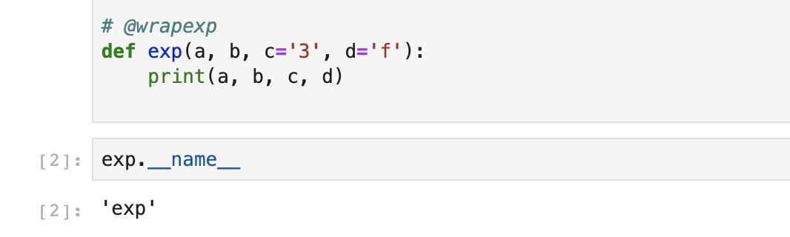
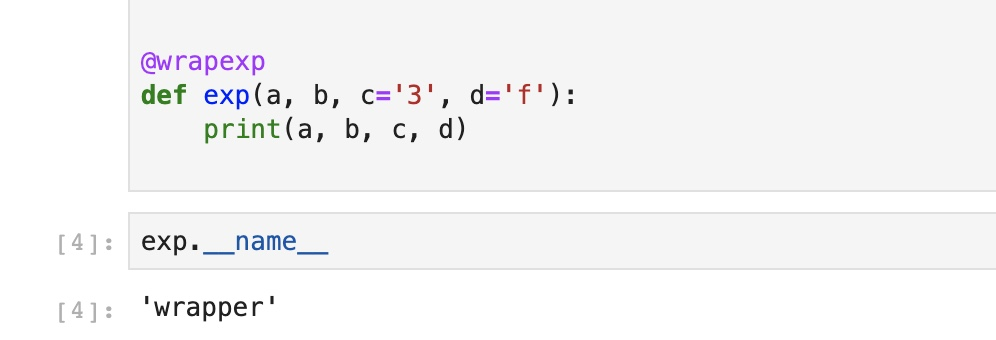
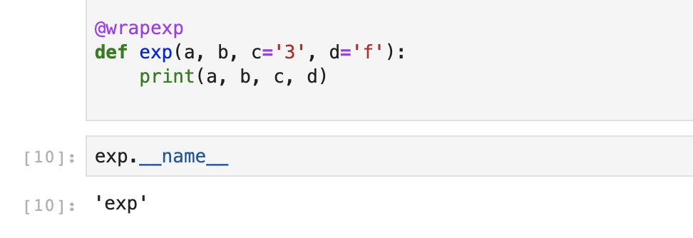

今天是Python专题的第12篇文章，我们来看看Python装饰器。

## 一段囧事

差不多五年前面试的时候，我就领教过它的重要性。那时候我Python刚刚初学乍练，看完了廖雪峰大神的博客，就去面试了。我应聘的并不是一个Python的开发岗位，但是JD当中写到了需要熟悉Python。我看网上的面经说到Python经常会问装饰器，我当时想的是装饰器我已经看过了，应该问题不大……

没想到面试的时候还真的问到了，面试官问我Python当中的装饰器是什么。由于紧张和遗忘，我支支吾吾了半天也没答上来。我隐约听到了电话那头的一声叹息……

时隔多年，我已经不记得那是一家什么公司了（估计规模也不大），但装饰器很重要这个事情给我深深打下了烙印。

## 装饰器本质

如今如果再有面试官问我Python中的装饰器是什么，我一句话就能给回答了，倒不是我装逼，实际上也的确只需要一句话。Python中的装饰器，本质上就是一个高阶函数。

你可能不太清楚高阶函数的定义，没关系，我们可以类比一下。在数学当中高阶导数，比如二次导数，表示导数的导数。那么这里高阶函数自然就是函数的函数，结合我们之前介绍过的函数式编程，也就是说是一个返回值是函数的函数。但是这个定义是充分不必要的，也就是说装饰器是高阶函数，但是高阶函数并不都是装饰器。装饰器是高阶函数一种特殊的用法。

### 任意参数

在介绍装饰器的具体使用之前，我们先来了解和熟悉一下Python当中的任意参数。

Python当中支持任意参数，它写成\*args, \*\*kw。表示的含义是接受任何形式的参数。

举个例子，比如我们定义一个函数：

```python
def exp(a, b, c='3', d='f'):
    print(a, b, c, d)
```

我们可以这样调用：

```python
args = [1, 3]
dt = {'c': 4, 'd': 5}

exp(*args, **dt)
```

最后输出的结果是1， 3， 4， 5。也就是说我们用一个list和dict可以表示任何参数。因为Python当中规定必选参数一定写在可选参数的前面，而必选参数是可以不用加上名称标识的，也就是可以不用写a=1，直接传入1即可。那么这些没有名称标识的必选参数就可以用一个list来表示，而可选参数是必须要加上名称标识的，这些参数可以用dict来表示，这两者相加可以表示任何形式的参数。

注意我们传入list和dict的时候前面加上了\*和\*\*，它表示将list和dict当中的所有值展开。如果不加的话，list和dict会被当成是整体传入。

所以如果一个函数写成这样，它表示可以接受任何形式的参数。

```python
def exp(*args, **kw):
    pass
```

### 定义装饰器

明白了任意参数的写法之后，装饰器就不难了。

既然我们可以用\*args, \*\*kw接受任何参数。并且Python当中支持一个函数作为参数传入另外一个函数，如果我们把函数和这个函数的所有参数全部传入另外一个函数，那么不就可以实现代理了吗？

还是刚才的例子，我们额外增加一个函数：

```python

def exp(a, b, c='3', d='f'):
    print(a, b, c, d)

def agent(func, *args, **kwargs):
    func(*args, **kwargs)

args = [1]
dt = {'b': 1, 'c': 4, 'd': 5}

agent(exp, *args, **dt)
```

装饰器的本质其实就是这样一个agent的函数，但是如果使用的时候需要手动传入会非常麻烦，使用起来不太方便。所以Python当中提供了特定的库，我们可以让装饰器以注解的方式使用，大大简化操作：

```python
from functools import wraps

def wrapexp(func):
    def wrapper(*args, **kwargs):
        print('this is a wrapper')
        func(*args, **kwargs)
    return wrapper


@wrapexp
def exp(a, b, c='3', d='f'):
    print(a, b, c, d)


args = [1, 3]
dt = {'c': 4, 'd': 5}

exp(*args, **dt)
```

在这个例子当中，我们定义了一个wrapexp的装饰器。我们在其中的wrapper方法当中实现了装饰器的逻辑，wrapexp当中传入的参数func是一个函数，wrapper当中的参数则是func的参数。所以我们在wrapper当中调用func(\*args, \*\*kw)，就是调用打上了这个注解的函数本身。比如在这个例子当中，我们没有做任何事情，只是在原样调用之前多输出了一行’this is a wrapper'，表示我们的装饰器调用成功了。

## 装饰器用途

我们理解了装饰器的基本使用方法之后，自然而然地会问一个天然的问题，学会了它究竟有什么用呢？

如果你从上面的例子当中没有领会到装饰器的强大，不如让我用一个例子再来暗示一下。比如说你是一个程序员，辛辛苦苦做出了一个功能，写了好几千行代码，上百个函数，终于通过了审核上线了。这个时候，你的产品经理找到了你说，经过分析我们发现上线的功能运行速度不达标，经常有请求超时，你能不能计算一下每个函数运行的耗时，方便我们找到需要优化的地方？

这是一个非常合理的请求，但想想看你写了上百个函数，如果每一个函数都要手动添加时间计算，这要写多少代码？万一哪个函数不小心改错了，你又得一一检查，并且如果要求严格的话你还得为每一个函数专门写一个单元测试……

我想，正常的程序员应该都会抗拒这个需求。

但是有了装饰器就很简单了，我们可以实现一个计算函数耗时的装饰器，然后我们只需要给每一个函数加上注解就好了。

```python
import time
from functools import wraps
def timethis(func):
    def wrapper(*args, **kwargs):
        start = time.time()
        result = func(*args, **kwargs)
        end = time.time()
        print(func.__name__, end-start)
        return result
    return wrapper
```

这也是装饰器最大的用户，可以在不修改函数内部代码的前提下，为它包装一些额外的功能。

## 元信息

我们之前说过装饰器的本质是高阶函数，所以我们也可以和高阶函数一样来调用装饰器，比如下面这样：

```python
def exp(a, b, c='3', d='f'):
    print(a, b, c, d)


args = [1, 3]
dt = {'c': 4, 'd': 5}

f = wrapexp(exp)
f(*args, **dt)
```

这样的方式得到的结果和使用注解是一样的，也就是说我们加上注解的本质其实就是调用装饰器返回一个新的函数。

既然和高阶函数是一样的，那么就带来了一个问题，我们使用的其实已经不再是原函数了，而是一个由装饰器返回的新函数，虽然这个函数的功能和原函数一样，但是一些基础的信息其实已经丢失了。

比如我们可以打印出函数的name来做个实验：



正常的函数调用__name__返回的都是函数的名称，但是当我们加上了装饰器的注解之后，就会发生变化，同样，我们输出加上了装饰器注解之后的结果：



我们会发现输出的结果变成了wrapper，这是因为我们实现的装饰器内部的函数叫做wrapper。不仅仅是__name__，函数内部还有很多其他的基本信息，比如记录函数内描述的__doc__，__annotations__等等，这些基本信息被称为是元信息，这些元信息由于我们使用注解发生了丢失。

有没有什么办法可以保留这些函数的元信息呢？

其实很简单，Python当中为我们提供了一个专门的迭代器用来保留函数的元信息，我们只需要在实现装饰器的wrapper函数当中加上一个注解wraps即可。

```python
def wrapexp(func):
    @wraps(func)
    def wrapper(*args, **kwargs):
        print('this is a wrapper')
        func(*args, **kwargs)
    return wrapper
```

加上了这个注解之后，我们再来检查函数的元信息，会发现它和我们预期一致了。



## 总结

了解了Python中的装饰器之后，再来看之前我们用过的@property, @staticmethod等注解，想必都能明白，它们背后的实现其实也是装饰器。灵活使用装饰器可以大大简化我们的代码， 让我们的代码更加规范简洁，还能灵活地实现一些特殊的功能。

装饰器的用法很多，今天介绍的只是其中最基本的，在后续的文章当中，还会继续和大家分享它更多其他的用法。在文章开始的时候我也说了，装饰器是Python进阶必学的技能之一。想要熟练掌握这门语言，灵活运用，看懂大佬的源码，装饰器是必须会的东西。

希望大家都能有所收获，原创不易，厚颜求个赞和转发~

