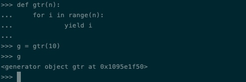

今天是周一Python专题，给大家带来的是Python当中生成器和迭代器的使用。

我当初第一次学到迭代器和生成器的时候，并没有太在意，只是觉得这是一种新的获取数据的方法。对于获取数据的方法而言，我们会一种就足够了。但是在我后来Python的使用以及TensorFlow等学习使用当中，我发现很多地方都用到了迭代器和生成器，或者是直接使用，或者是借鉴了思路。所以我们不能掉以轻心，今天就让我们仔细来看看，它们到底是怎么回事。

## 迭代器

我们先从[迭代器]("https://www.programiz.com/python-programming/iterator" "programiz")开始入手，迭代器并不是Python独有的概念，在C++和Java当中都有iterator的概念，两者的使用也都差不多。迭代器主要解决了一个问题，在一个复杂场景下，获取数据怎么尽可能简便。

我们来假设一个场景，假设我们从某个数据源获取了一批数据。然后我们需要调用前一万条生成一个结果，得到结果之后，我们要将剩下的数据交给另一个调用方去处理。这个过程看起来非常平常，但是隐藏了两个问题，第一个问题是如果我们能保证第一次处理的时候，每次都是使用一万条还好说，如果我们使用的条数是一个动态的值呢？显然，我们需要一个变量来记录我们究竟用了多少条数据，和这批数据的状态。其次，如果这个数据量很大会存在一个数据传输的问题。我们每次都要将一大批数据传来传去，显然会消耗很多资源。

还有一个场景是如果我们开发的是一个比较复杂的数据结构，比如一棵多叉树，下游想要遍历它的时候，必须要了解它的实现原理才行。这显然也不太友好。

迭代器的出现正是针对以上这些问题，它的含义也很简单，有点像是我们遍历链表的时候用到的cur的指针。永远指向当前的位置，永远知道下一个位置在哪里。

## 容器迭代器


我们先从简单的元素迭代器开始了解它的用途，我们都知道Python当中经典的几个容器：list, tuple和dict。它们都是一个可迭代对象，我们可以直接使用关键字iter获取一个对应的迭代器。

我们来看一个例子：

```python
arr = [1, 3, 4, 5, 9]

it = iter(arr)

print(next(it))
print(next(it))
```

这是一个非常经典的例子，我们首先定义了一个数组，然后通过iter关键字获取了一个读取它的迭代器。有了迭代器之后我们可以通过next关键字获取迭代器当中的下一个元素，我们一共调用了两次next，第一次输出的结果是1，第二次的结果是3。和我们刚才说的一样，我们每一次调用，它会自动往后移动一格，获取后面一位的数据。

这里有一点需要注意，因为我们创建的数组当中一共只有5个元素，如果我们调用it的次数超过5次，那么会引发超界，Python的解释器会抛出StopIteration的error。

除了使用next，我们也可以使用for循环来迭代它：

```python
for i in it:
    print(i)
```

这种用法就和我们用for循环遍历元素是一样的。

### 自定义迭代器

官方的迭代器的用法就这么多，这也不是它的主要用法，它最主要的用法是我们自己创建迭代器。和之前介绍Python自定义排序的时候的思路一样，我们为类添加上__iter__方法和__next__方法即可。

其中__iter__方法用来初始化并返回迭代器，关于它的解释比较复杂。在Python当中迭代有两个概念一个是iterable，一个是iterator。协议规定iteratble的__iter__方法会返回一个iterator。而iterator本身也是一个iterable对象，自然也需要实现__iter__方法。

我知道这么说可能听不太明白，我举个例子，比如说员工和老板，员工没有审批权限，只能转达给老板。我们把员工比喻成iterable对象，老板比喻成iterator。

员工面临一个问题的时候没有权限处理，只能找来老板决定。也就是最终决定的是老板，但如果是老板自己发现的问题，他完全可以自己就解决了，不需要再去找其他人。所以说我们用iter调用iterable对象的__iter__的时候，会得到一个iterator，也就是调用员工返回老板，然后通过调用iterator的__next__来进行迭代。

到这里也就清楚了，只有iterator有__next__方法，而iterable没有，并且__iter__返回的是一个iterator。然而我们定义的已经是iterator了，它同时也是一个iterable对象，所以调用__iter__时只需要返回self就好了。__next__方法很简单，对应迭代器的next方法，用来返回下一个迭代的元素。

我们来看一个例子：

```python
class PowTwo:
    """Class to implement an iterator
    of powers of two"""

    def __init__(self, max = 0):
        self.max = max

    def __iter__(self):
        self.n = 0
        return self

    def __next__(self):
        if self.n <= self.max:
            result = 2 ** self.n
            self.n += 1
            return result
        else:
            raise StopIteration
```

这是一个简单的生成2的幂的迭代器，我们在__iter__里为self.n初始化为0，然后返回自身。在__next__里判断有没有迭代结束，如果结束的话抛出一个异常。

我们来看使用它的例子：

```python
>>> a = PowTwo(4)
>>> i = iter(a)
>>> next(i)
1
>>> next(i)
2
>>> next(i)
4
>>> next(i)
8
>>> next(i)
16
>>> next(i)
Traceback (most recent call last):
...
StopIteration
```
我们也可以用for循环来迭代它：

```python
>>> for i in PowTwo(5):
...     print(i)
...     
1
2
4
8
16
32
```

迭代器除了可以迭代一个容器或者是像上面这样自定义迭代方法之外，还可以用来迭代生成器。下面就让我们一起来看下生成器的概念。

## 生成器

生成器的概念和迭代器相辅相成，迭代器是生成一个遍历数据的迭代工具，而生成器则是数据生成工具。

举个很简单的例子，比如说斐波那契数列我们都知道，从第三个数开始等于前面两个数的和。比如我们想获取100万个斐波那契数列，按照传统的方法我们需要开辟一个长度是一百万的数组，然后按照斐波那契数列的定义一个一个地计算。显然这样会消耗大量的空间，有没有办法我们和迭代器那样构建一个生成数据的方法，我们每次调用获取下一个结果呢？这样我们要多少数据就调用多少次就可以了，从根本上解决了存储的问题。

下面我们来看怎么定义一个生成器。

### 括号创建法

最简单的方法真的很简单，和我们创建list基本上一模一样。

在Python当中，我们经常这样初始化一个数组：

```python
arr = [i * 3 for i in range(10)]
```

也就是说我们把循环放在list的定义当中，这样Python会自动执行里面的循环，然后将所有循环的结果进行二次计算后写入到list当中去。我们稍微变形一下，就得到了一个最简单的生成器。

```python
g = (i * 3 for i in range(10))

print(next(g))
```

看清楚了吗，其实和list没什么差别，只是我们将最外层的括号从[]换成了()。

这种方法大家应该都能看懂，但是可能会有一个疑惑。我们这样做的意义是什么呢？这样和上面用[]定义有什么区别呢？

其实是有区别的，如果没有区别，那么我们用生成器也就没有意义了。它的区别也就是生成器的意义，简单来说，我们前文中已经说过了当定义一个list的时候，Python会自动将for循环执行一遍，然后将结果写入进list当中。但是生成器不会，虽然我们也用到了for循环，但是它只是起到了限制个数的作用，在执行完这一步之后，Python并不会将for循环执行结束。只有我们每次调用next，才会触发它进行一次循环。

不相信的同学可以试试，看看运行一下下面两个语句的区别：

```python
g = (i for i in range(1000000000))
g = [i for i in range(1000000000)]
```

如果奇怪的事情发生了，不妨再回到文章来思考一下。

### 函数创建法

上面介绍的方法虽然简单，但是不太实用，因为很多时候我们想要的数据构造方法会比较复杂，很难用这种形式展现出来。

所以Python当中还为我们提供了一种构造生成器的方法，相比起来要稍微复杂一点点，但是也很好用。我们来看一个例子：

```python
def gtr(n):
    for i in range(n):
        yield i
```

从代码上来看，我们好像定义了一个函数，某种程度上可以这么理解，但是它返回的结果并不是一个值，而是一个[生成器]("https://www.liaoxuefeng.com/wiki/1016959663602400/1017323698112640" "廖雪峰的Python教程")。

如果你真的去试了，你会得到一个generator类型的实例，这也是Python自带的生成器的实例。



再仔细观察一下，你会发现这个函数当中的关键字和一般的不太一样，它没有使用return，而是使用了yield。yield和return在很大程度上很接近，但是又有些不同。

相同点是当我们执行到yield时，和return一样会将yield之后的内容返回给调用方。比如上面代码当中写到yield i，那么我们运行next的时候就会获取到这个i。

不同的地方是，当我们下一次再次执行的时候，会继续从yield处开始往下执行。有些类似于递归的时候，底层的递归执行结束回到上层的情况。因此如果我们要获取多个值，需要在生成器当中使用循环。举个例子：

```python
def test():
    n = 0
    while True:
        if n < 3:
            yield n
            n += 1
        else:
            yield 10
            
            
if __name__ == '__main__':
    t = test()
    for i in range(10):
        print(next(t))
```

我们如果执行上面这段代码，前三个数是0，1和2，从第四个数开始一直是10。如果你能看懂这个例子，一定能明白yield的含义。

### yield from

接下来要介绍的yield from和yield用法差不多，也是从生成器返回一个结果，并且下次执行的时候从返回的位置开始继续执行。

但是它有一点和yield不同，我们来看一个经典的例子。

```python
def g1():     
     yield  range(5)
def g2():
     yield  from range(5)

it1 = g1()
it2 = g2()
for x in it1:
    print(x)

for x in it2:
    print(x)
```

这两者打印出来的结果是一样的，但是逻辑完全不同。在第一个生成器g1当中，直接通过yield返回了一个迭代器。也就是说我们for循环执行的其实是range(5)，而第二个生成器g2则通过yield from获取了range(5)这个迭代器当中的值进行的返回。

也就是说yield from可以返回一个迭代器或者是生成器执行next之后的结果。

最后，我们来看一个yield from使用的一个经典场景：二叉树的遍历：

```python
class Node:

    def __init__(self, key):
        self.key = key
        self.lchild = None
        self.rchild = None
        self.iterated = False
        self.father = None

    def iterate(self):
        if self.lchild is not None:
            yield from self.lchild.iterate()
        yield self.key
        if self.rchild is not None:
            yield from self.rchild.iterate()
```

在这个代码当中我们定义了二叉树当中的一个节点，以及它对应的迭代方法。由于我们用到了yield来返回结果，所以iterate方法本质是一个生成器。再来看iterate方法内部，我们通过yield from调用了iterate，所以我们在执行的时候，它会自动继续解析node.lchild的iterate，也就是说我们通过yield from实现了递归。

当我们建好树之后，可以直接使用root.iterate来遍历整棵树。

```python
class Tree:

    def __init__(self):
        #建树过程
        self.root = Node(4)
        self.root.lchild = Node(3)
        self.root.lchild.father = self.root
        self.root.rchild = Node(5)
        self.root.rchild.father = self.root
        self.root.lchild.lchild = Node(1)
        self.root.lchild.lchild.father = self.root.lchild
        self.root.rchild.rchild = Node(7)
        self.root.rchild.rchild.father = self.root.rchild

    def iterate(self):
        yield from self.root.iterate()
```

通过yield from，我们可以很轻松地利用递归的思路来实现树上的生成器。从而可以很方便地以生成器的思路来遍历树上所有的元素。

到这里，关于Python当中迭代器和生成器的知识就算是讲完了，这两者的概念有些接近，但是又不完全一样，很多初学者容易搞混淆。

其实可以这么理解，迭代器和生成器遍历元素的方式是一样的，都是通过调用next来获取下一个元素。我们通过yield创建函数，返回的结果其实就是生成器生成的数据的迭代器。也就是说迭代器只是迭代和获取数据的，但是并不能无中生有地创造数据。而生成器的主要作用是创造数据，它生成出来的数据是以迭代器的形式返回的。

举个例子，你开了一个奶茶店，通过奶茶店每个月可以在银行账户里获得一笔收入。迭代器就是这个账户，通过它你可以获得一笔一笔的收入。而奶茶店则是一个生成器，它产出数据，但是是以迭代器的形式返回给你的，也就是以银行账户的方式给你收入。我们拿到银行卡并不知道它里面的钱是怎么赚来的，只能看到钱，也就是说我们并不知道迭代器背后数据的逻辑。但是生成器我们是清楚的，因为钱（生产逻辑）是我们亲自赚来的。

今天的文章就是这些，如果觉得有所收获，请顺手点个关注吧，你们的举手之劳对我来说很重要。


